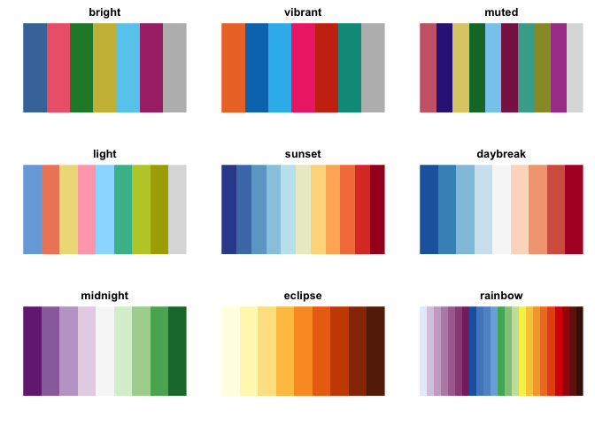
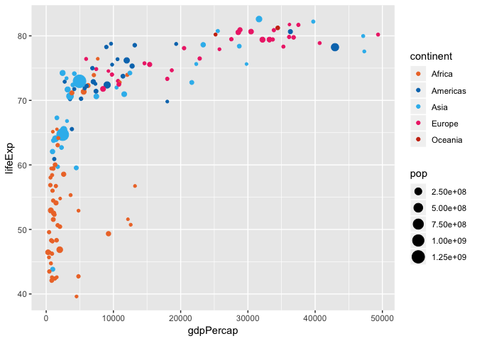

<!-- README.md is generated from README.Rmd. Please edit that file -->
disco
=====

This package provides 9 discrete color palettes developed by Paul Tol at <https://personal.sron.nl/~pault/> for qualitative, diverging, and sequential data. Colors within each palette are designed to match well together and be readable by all audiences, including color-blind readers.

Installation
------------

`disco` can be installed directly from GitHub:

``` r
# install.packages("devtools")
devtools::install_github("nsgrantham/disco")
```

Palettes
--------

The `disco` API is similar to other color palette packages like [`viridis`](https://github.com/sjmgarnier/viridis) and [`scico`](https://github.com/thomasp85/scico).

View all 9 color palettes with `disco_palettes_show()`

``` r
library(disco)

disco_palette_show()
```



The following table summarizes the 9 color palettes. For more information, consult Paul Tol's Notes <https://personal.sron.nl/~pault/>.

<table style="width:83%;">
<colgroup>
<col width="20%" />
<col width="26%" />
<col width="16%" />
<col width="19%" />
</colgroup>
<thead>
<tr class="header">
<th>Palette</th>
<th>n</th>
<th>Data type</th>
<th>Description</th>
</tr>
</thead>
<tbody>
<tr class="odd">
<td>bright</td>
<td>7</td>
<td>Qualitative</td>
<td>Good for lines and their labels.</td>
</tr>
<tr class="even">
<td>vibrant</td>
<td>7</td>
<td>Qualitative</td>
<td>Built around the signature orange #FF7043 of the data visualization framework TensorBoard.</td>
</tr>
<tr class="odd">
<td>muted</td>
<td>10</td>
<td>Qualitative</td>
<td>Good for lines and maps.</td>
</tr>
<tr class="even">
<td>light</td>
<td>9</td>
<td>Qualitative</td>
<td>Good for filled cells and backgrounds because it keeps black text readable.</td>
</tr>
<tr class="odd">
<td>sunset</td>
<td>11</td>
<td>Diverging</td>
<td>This is related to the ColorBrewer RdYlBu scheme, but with darker central colours and made more symmetric.</td>
</tr>
<tr class="even">
<td>daybreak</td>
<td>9</td>
<td>Diverging</td>
<td>This is the reversed ColorBrewer RdBu scheme.</td>
</tr>
<tr class="odd">
<td>midnight</td>
<td>9</td>
<td>Diverging</td>
<td>This is the ColorBrewer PRGn scheme, with green #A6DBA0 shifted to #ACD39E to make it print-friendly.</td>
</tr>
<tr class="even">
<td>eclipse</td>
<td>9</td>
<td>Sequential</td>
<td>This is the ColorBrewer YlOrBr scheme, with orange #FE9929 shifted to #FB9A29 to make it print-friendly.</td>
</tr>
<tr class="odd">
<td>rainbow</td>
<td>23</td>
<td>Sequential</td>
<td>This should not be used on a continuous scale, but on a discrete scale it offers up to 23 colors and remains relatively color-blind safe.</td>
</tr>
</tbody>
</table>

Select a palette by name:

``` r
disco(palette = "sunset")
#>  [1] "#364B9A" "#4A7BB7" "#6EA6CD" "#98CAE1" "#C2E4EF" "#EAECCC" "#FEDA8B"
#>  [8] "#FDB366" "#F67E4B" "#DD3D2D" "#A50026"
```

Scales are provided for `ggplot2`:

``` r
library(ggplot2)
library(dplyr)
library(gapminder)

ggplot(filter(gapminder, year == 2007), 
       aes(gdpPercap, lifeExp, size = pop, color = continent)) +
  geom_point() +
  scale_color_disco(palette = "vibrant")
```



Happy plotting!

References
----------

<https://www.colorbrewer2.org> by Cynthia A. Brewer, Geography, Pennsylvania State University
<https://personal.sron.nl/~pault/> by Paul Tol, Netherlands Institute for Space Research (SRON)
